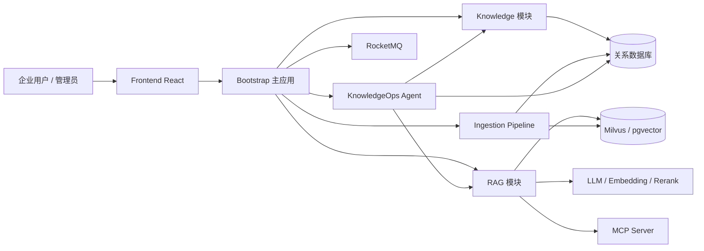
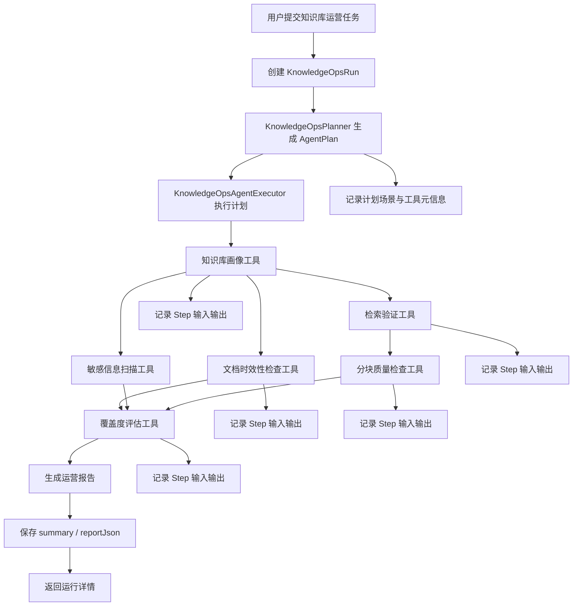

# 企业级应用软件设计与开发大作业报告

## 封面页

| 字段 | 内容 |
| --- | --- |
| 课程名称 | 企业级应用软件设计与开发 |
| 项目名称 | Ragent：面向企业知识库自治运营的 Agentic RAG 智能体系统 |
| 方向 | 方向一：Agentic AI 原生开发 |
| 学号 | 【待补充：学号】 |
| 姓名 | 【待补充：姓名】 |
| 专业 | 【待补充：计算机技术 / 软件工程】 |
| 指导教师 | 戚欣 |
| 提交日期 | 2026 年 6 月 22 日 |

> 【说明】最终提交文件为 `docs/CS599_大作业报告.pdf`。从 Markdown / Word / LaTeX 导出 PDF 时，需要启用标题书签或导航窗格，保证评阅时可以通过目录跳转。

---

## 目录

1. 选题背景与设计思想
2. Specs 规格文档
3. 系统架构与设计
4. 关键实现与代码展示
5. 测试与评估
6. 系统升级与扩展
7. 课程总结

---

# 一、选题背景与设计思想

## 1.1 问题定义

随着企业数字化系统不断增多，制度文档、流程规范、产品手册、研发文档、运维知识、客户支持记录等知识资产持续积累。传统知识库通常依赖人工分类、人工维护和关键词搜索，面对大规模、异构、快速变化的企业知识时，会出现以下问题：

- 知识分散在多个系统中，文档格式不统一，入库链路复杂。
- 文档更新频繁，知识库是否覆盖最新业务内容难以及时判断。
- 传统关键词搜索对同义表达、口语化问题和跨文档推理支持不足。
- 普通 RAG 系统可以完成“检索 + 生成”，但很难回答“知识库质量是否健康”“当前任务是否有足够知识支撑”“哪些分块影响检索效果”等运营问题。
- 企业级应用需要可观测、可追踪、可回放、可扩展，而许多 Demo 级 RAG 项目缺少工程化闭环。

因此，本项目将目标定义为：构建一个面向企业知识库自治运营的 Agentic RAG 智能体系统。系统不仅支持文档入库和智能问答，还通过 Planner 生成运营计划，由 Executor 调用 Agent 工具链，自动完成知识库画像、文档时效性检查、敏感信息扫描、检索验证、分块质量检查、覆盖度评估和运营报告生成，使知识库从“被动存储”升级为“可诊断、可评估、可持续优化”的智能知识基础设施。

## 1.2 现有方案不足

现有知识库和 RAG 方案大致可以分为三类：

第一类是传统文档管理系统。它们通常具备文档上传、目录分类、权限控制和关键词检索能力，但缺少语义理解能力。用户必须知道准确关键词或文档位置，知识发现效率较低。

第二类是基础 RAG 问答系统。它们通过文档切分、Embedding、向量检索和大模型生成提升问答体验，但许多系统只关注一次问答链路，对企业级场景中的数据质量、分块质量、检索覆盖度、模型路由、异常回退和运行追踪考虑不足。

第三类是通用 Agent 框架。它们强调模型自主规划和工具调用，但如果缺少企业知识库领域工具、数据指标和工程约束，容易变成不可控的开放式推理过程，难以稳定落地到企业级应用。

本项目的设计重点是在 RAG 基础能力上增加面向知识库运营的自治 Agent。它不追求让模型无限自由地调用工具，而是围绕知识库健康诊断设计可解释、可记录、可扩展的工具链，使 Agent 的行为更加稳定、可审计、可评估。

## 1.3 项目价值

本项目的价值主要体现在四个方面：

1. 提升知识库可用性  
   通过检索验证和覆盖度评估，判断知识库是否能够支撑指定任务，避免知识库“看似有文档，实际答不上来”。

2. 降低知识运营成本  
   通过自动巡检 Chunk 数量、禁用分块、空分块、过短分块、过长分块、重复分块等指标，辅助管理员快速定位知识质量问题。

3. 增强 RAG 工程闭环  
   从文档入库、分块、向量索引、意图识别、多通道检索、问答生成，到 Agent 评估报告，形成完整闭环。

4. 符合企业级应用要求  
   项目采用前后端分离、模块分层、统一接口、运行记录、异常回退、配置化扩展等工程实践，便于持续演进。

## 1.4 技术路线

项目采用 Java 企业级技术栈和 AI 应用工程技术相结合的路线：

- 后端框架：Spring Boot 3.5.7
- 构建工具：Maven 多模块工程
- 前端框架：React + TypeScript + Vite
- 文档解析：Apache Tika
- 向量数据库：Milvus / PostgreSQL pgvector
- 数据访问：MyBatis-Plus
- 消息队列：RocketMQ
- 权限认证：Sa-Token
- AI 基础设施：LLM Chat、Embedding、Rerank 客户端抽象
- Agent 架构：工具抽象、工具注册、上下文传递、步骤记录、报告生成
- RAG 核心能力：问题改写、意图识别、多通道检索、MCP 工具集成、Prompt 组装、流式输出

系统整体上遵循“平台能力分层 + Agent 工具化 + RAG 流程工程化”的技术路线。底层提供文档处理、向量检索、模型调用等基础能力；中层提供 RAG 对话链路和知识库管理能力；上层通过知识库自治运营 Agent 对系统能力进行组合和评估。

---

# 二、Specs 规格文档

## 2.1 Product Spec

### 2.1.1 产品定位

Ragent 是一个面向企业知识库场景的 Agentic RAG 平台。系统既支持企业用户基于知识库进行智能问答，也支持管理员通过自治运营 Agent 对知识库进行质量评估和优化建议生成。

项目定位不是简单的聊天机器人，而是企业知识库全生命周期管理系统，包括文档入库、知识组织、语义检索、智能问答、质量评估和运营报告。

### 2.1.2 目标用户

- 企业知识库管理员：负责知识库创建、文档维护、质量检查和运营分析。
- 企业内部员工：通过自然语言问答获取制度、流程、技术、业务知识。
- 研发与运维人员：关注系统可扩展性、检索效果、运行日志和模型调用稳定性。
- 管理者：通过运营报告了解知识库建设质量和改进方向。

### 2.1.3 核心场景

场景一：企业文档入库  
管理员上传本地文件或配置外部数据源，系统解析文档内容，执行分块、增强、索引，并写入关系数据库和向量数据库。

场景二：智能知识问答  
用户输入自然语言问题，系统加载对话记忆，进行问题改写和意图识别，再通过多通道检索获取证据，最终由大模型生成带上下文依据的答案。

场景三：知识库自治运营  
管理员输入一个运营任务，例如“评估该知识库是否能够支撑新人入职制度问答”。Agent 自动执行知识库画像、检索验证、分块质量检查和覆盖度评估，并生成结构化报告。

场景四：问题定位和持续优化  
系统记录 Agent 每一步输入输出。管理员可以查看某次运行的步骤、工具结果、错误信息和最终报告，用于后续文档补充、重新分块或检索参数优化。

### 2.1.4 功能需求

| 功能模块 | 功能描述 | 优先级 |
| --- | --- | --- |
| 知识库管理 | 创建、编辑、查询知识库，维护 collection、Embedding 模型等信息 | 高 |
| 文档管理 | 支持文档上传、解析、启用/禁用、删除和状态查看 | 高 |
| 文档入库 Pipeline | 支持 Fetcher、Parser、Chunker、Enhancer、Enricher、Indexer 节点编排 | 高 |
| RAG 问答 | 支持多轮问答、问题改写、意图识别、检索增强生成 | 高 |
| 多通道检索 | 支持向量全局检索、意图定向检索、后置处理和 Rerank | 高 |
| Agent 运营任务 | 支持启动知识库自治运营任务，基于 Planner 选择质量、检索、安全、上线检查等场景 | 高 |
| Agent 步骤记录 | 记录每个工具的输入、输出、状态、异常和时间 | 高 |
| 运营报告生成 | 根据各工具结果生成覆盖度分数、发现问题和优化建议 | 高 |
| 安全与时效诊断 | 检查敏感信息命中、过期文档、失败入库文档和待处理文档 | 中 |
| 可观测性 | 支持 Trace、运行日志、任务状态和错误信息查询 | 中 |
| MCP 扩展 | 支持非知识类意图通过 MCP 工具调用外部业务系统 | 中 |

### 2.1.5 非功能需求

- 可扩展性：新增 Agent 工具或检索通道时，应只需实现接口并注册为 Spring Bean。
- 可维护性：系统按模块和业务边界分层，避免 AI 调用逻辑侵入业务代码。
- 可观测性：Agent 每一步执行结果需要持久化，便于回放和问题定位。
- 容错性：检索失败时提供回退逻辑；模型调用失败时尽量不影响整体服务可用性。
- 性能要求：检索链路支持并行通道和 Top-K 控制，避免无界消耗。
- 安全性：用户上下文、权限认证和数据隔离需要与企业级后台体系结合。

## 2.2 Architecture Spec

项目采用 Maven 多模块架构，主要模块如下：

```text
ragent/
├── framework/       # 共享基础设施：上下文、DTO、异常、MQ、Trace 等
├── infra-ai/        # AI 基础设施：LLM Chat、Embedding、Rerank 客户端抽象
├── mcp-server/      # MCP Server：向外暴露可调用工具
├── bootstrap/       # 主应用：知识库、RAG、Agent、用户、管理后台
└── frontend/        # 前端应用：React + TypeScript
```

其中，`bootstrap` 是业务核心模块，包含以下关键包：

```text
com.nageoffer.ai.ragent
├── agent       # 知识库自治运营 Agent
├── core        # 文档解析和分块基础能力
├── ingestion   # 文档入库 Pipeline
├── knowledge   # 知识库、文档、Chunk 管理
├── rag         # RAG 核心逻辑：意图、检索、Prompt、MCP、记忆
├── admin       # 管理后台
└── user        # 用户与认证
```

模块分层设计的核心思想是：`framework` 提供通用能力，`infra-ai` 屏蔽模型供应商差异，`bootstrap` 聚合业务场景，`mcp-server` 提供工具扩展边界，`frontend` 承载交互界面。这样可以降低模型、检索、业务和前端之间的耦合。

## 2.3 API Spec

### 2.3.1 知识库自治运营 API

| API | 方法 | 说明 |
| --- | --- | --- |
| `/agent/knowledge-ops/runs` | POST | 启动一次知识库自治运营任务 |
| `/agent/knowledge-ops/runs` | GET | 分页查询 Agent 运行记录 |
| `/agent/knowledge-ops/runs/{run-id}` | GET | 查询某次运行详情和报告 |
| `/agent/knowledge-ops/runs/{run-id}/steps` | GET | 查询某次运行的步骤列表 |

启动任务请求示例：

```json
{
  "kbId": "kb_001",
  "task": "评估该知识库是否能够支撑新人入职制度问答",
  "topK": 8
}
```

返回结果核心字段：

```json
{
  "id": "run_001",
  "kbId": "kb_001",
  "task": "评估该知识库是否能够支撑新人入职制度问答",
  "status": "SUCCESS",
  "summary": "KnowledgeOps Agent evaluated knowledge base ...",
  "report": {
    "coverageLevel": "GOOD",
    "coverageScore": 82,
    "findings": [],
    "recommendations": [],
    "markdown": "# KnowledgeOps Agent Report..."
  }
}
```

### 2.3.2 RAG 问答 API

RAG 问答接口负责接收用户问题，执行记忆加载、问题改写、意图识别、检索、Prompt 组装和模型生成。该接口应支持流式输出，以改善用户体验。

请求核心字段包括：

- `conversationId`：会话 ID
- `question`：用户问题
- `userId`：用户标识
- `topK`：检索数量
- `kbId` 或 `collectionName`：知识库范围

响应核心内容包括：

- 模型生成文本
- 检索证据
- 意图分类结果
- Trace 信息
- 异常或兜底提示

### 2.3.3 知识库与文档 API

知识库与文档 API 主要负责：

- 知识库创建、分页查询、修改和删除
- 文档上传、远程文件抓取、解析状态查询
- Chunk 查询、编辑、启用和禁用
- 入库任务创建、执行和状态查询

这些 API 为 RAG 问答和 Agent 评估提供数据基础。

## 2.4 Data Spec

### 2.4.1 Agent Run

Agent Run 表示一次知识库自治运营任务，核心字段包括：

| 字段 | 说明 |
| --- | --- |
| `id` | 运行 ID |
| `userId` | 发起用户 |
| `kbId` | 被评估知识库 |
| `task` | 运营任务描述 |
| `status` | RUNNING / SUCCESS / FAILED |
| `summary` | 报告摘要 |
| `reportJson` | 结构化报告 JSON |
| `errorMessage` | 错误信息 |
| `startedAt` | 开始时间 |
| `finishedAt` | 结束时间 |

### 2.4.2 Agent Step

Agent Step 表示 Agent 工具链中的一个执行步骤，核心字段包括：

| 字段 | 说明 |
| --- | --- |
| `runId` | 所属运行 |
| `stepOrder` | 执行顺序 |
| `stepType` | 步骤类型，如 PROFILE / RETRIEVE / INSPECT / EVALUATE |
| `toolName` | 工具名称 |
| `status` | RUNNING / SUCCESS / FAILED |
| `inputJson` | 工具输入 |
| `outputJson` | 工具输出 |
| `errorMessage` | 异常信息 |
| `startedAt` | 开始时间 |
| `finishedAt` | 结束时间 |

### 2.4.3 Knowledge Chunk

Knowledge Chunk 是 RAG 检索的基本单元，核心字段包括：

| 字段 | 说明 |
| --- | --- |
| `id` | Chunk ID |
| `kbId` | 知识库 ID |
| `docId` | 来源文档 ID |
| `content` | 分块文本 |
| `contentHash` | 内容哈希，用于重复检测 |
| `enabled` | 是否启用 |
| `deleted` | 是否删除 |

---

# 三、系统架构与设计

## 3.1 总体架构

系统采用前后端分离和后端多模块分层架构。前端负责知识库管理、问答界面、Agent 运行记录和报告展示；后端负责业务编排、文档入库、RAG 检索、Agent 工具执行和模型调用；外部基础设施包括关系数据库、向量数据库、消息队列、对象存储和模型服务。


> 【截图占位 3-1：系统本地运行首页或管理后台总览截图】

总体架构可以抽象为：



## 3.2 Agent 自治运营设计

知识库自治运营 Agent 是本项目区别于普通 RAG 系统的关键设计。它以一次运营任务为输入，由 Planner 解析任务场景并产出执行计划，再由 Executor 按计划调用工具，最后聚合为结构化报告。

改造后的 Agent 不再把工具顺序硬编码在业务服务中，而是支持配置化 Workflow 和任务场景路由。系统内置四类场景：

- `quality`：知识库质量评估。
- `retrieval`：检索效果评估。
- `security`：敏感信息与安全风险检查。
- `release`：上线前综合检查。

默认质量评估工作流如下：

```text
knowledge-base-profile
  -> document-freshness-check
  -> knowledge-retrieval
  -> chunk-quality-inspect
  -> coverage-evaluate
  -> AgentReporter.buildReport()
```

对应流程如下：



这种设计具有三个特点：

1. 行为可解释  
   每一步工具都有明确输入、输出和业务含义，避免 Agent 执行过程变成不可解释的黑盒。

2. 结果可追踪  
   `AgentStepRecorder` 会记录每个步骤的运行状态、输入输出、异常和时间，便于定位问题。

3. 能力可扩展  
   新增工具只需实现 `AgentTool` 接口，并注册为 Spring Bean，再通过 `application.yaml` 或请求参数接入 Workflow。当前已经扩展了文档时效性检查和敏感信息扫描工具。

> 【截图占位 3-2：Agent Run 列表页面截图】

> 【截图占位 3-3：Agent Step 详情页面截图】

## 3.3 RAG 对话链路设计

RAG 对话链路入口为 `RAGChatServiceImpl.streamChat()`，核心执行由 `StreamChatPipeline` 完成。完整流程包括记忆加载、问题改写、意图识别、短路处理、检索、Prompt 组装和流式生成。


系统将一次用户问题处理为多个阶段：

1. 加载会话历史和摘要记忆。
2. 对用户问题进行同义词归一化、问题改写和子问题拆分。
3. 基于意图树和 LLM 分类识别用户意图。
4. 对系统闲聊、歧义问题、空检索等场景进行短路处理。
5. 对 KB 意图执行多通道检索，对 MCP 意图执行工具调用。
6. 根据 KB_ONLY、MCP_ONLY、MIXED 等场景选择 Prompt 模板。
7. 组装消息并调用模型流式输出。

该链路体现了 Agentic RAG 的工程化思路：系统不是简单把用户问题直接送入向量数据库，而是在检索前完成问题理解，在生成前完成证据组织，在异常场景下提供可控兜底。

## 3.4 多通道检索设计

RAG 系统的效果很大程度上取决于检索质量。项目设计了多通道并行检索和后置处理链路：


当前检索通道包括：

- `VectorGlobalSearchChannel`：向量全局检索。
- `IntentDirectedSearchChannel`：基于意图识别结果进行定向检索。
- `KeywordESSearchChannel`：作为未来关键词检索扩展方向。

后置处理器包括：

- `DeduplicationPostProcessor`：多通道结果去重。
- `RerankPostProcessor`：调用 Rerank 模型进行精排。
- 版本过滤、分数归一化等处理器可作为后续扩展。

多通道检索设计的优势在于：不同检索策略可以并行执行，结果统一进入后处理流水线，从而兼顾召回率、精确率和扩展性。

## 3.5 文档入库 Pipeline 设计

文档从上传到可检索，需要经过解析、切分、增强、索引等多个环节。项目采用基于节点编排的入库 Pipeline：


主要节点包括：

- Fetcher：从本地文件、HTTP URL、S3、飞书等来源获取文档。
- Parser：使用 Apache Tika 等解析器抽取文档文本。
- Chunker：根据固定长度或结构感知策略进行文本分块。
- Enhancer：对文档或分块进行摘要、标题补全等增强。
- Enricher：补充元数据，便于后续检索和过滤。
- Indexer：生成向量并写入向量数据库，同时保存分块信息。

Pipeline 节点化设计使系统可以针对不同知识源配置不同处理流程，也便于记录每个节点的执行日志和错误信息。

## 3.6 模型路由与容错设计

企业级 AI 应用不能完全依赖单个模型供应商。项目在 AI 基础设施层抽象了模型调用，并设计模型路由、健康检查和降级机制。


模型容错设计的目标包括：

- 当某个模型异常时，避免持续调用故障模型。
- 支持不同场景使用不同模型参数，例如 KB 场景降低温度以提高稳定性。
- 通过健康状态存储记录模型可用性，为后续自动切换提供依据。


---

# 四、关键实现与代码展示

## 4.1 Agent 核心循环

知识库自治运营 Agent 的核心实现由 `KnowledgeOpsAgentServiceImpl`、`KnowledgeOpsPlanner` 和 `KnowledgeOpsAgentExecutor` 协作完成。Service 负责创建运行记录和上下文，Planner 负责根据任务生成计划，Executor 负责执行工具并记录步骤，Reporter 负责聚合报告。

Service 侧核心逻辑如下：

```java
AgentPlan plan = planner.plan(context);
context.setPlan(plan);
context.setScenario(plan.getScenario());
executor.execute(plan, context);

KnowledgeOpsReport report = reporter.buildReport(context);
```

Planner 根据任务文本或请求参数选择场景：

```java
if (containsAny(task, "安全", "敏感", "泄露", "secret", "token", "password")) {
    return "security";
}
if (containsAny(task, "上线", "发布", "验收", "production", "release")) {
    return "release";
}
if (containsAny(task, "检索", "召回", "命中", "问答", "答案")) {
    return "retrieval";
}
return "quality";
```

Executor 负责把计划步骤转化为工具调用：

```java
for (AgentPlanStep planStep : plan.getSteps()) {
    AgentTool tool = toolMap.get(planStep.getToolName());
    executeTool(context.getRunId(), planStep, tool, context);
}
```

这段实现体现了 Agent 的基本执行范式：任务理解、计划生成、工具调用、状态记录、结果聚合和报告输出。

> 【截图占位 4-1：`KnowledgeOpsAgentServiceImpl` 核心代码截图】

## 4.2 Agent 工具抽象

所有 Agent 工具统一实现 `AgentTool` 接口：

```java
public interface AgentTool {

    String name();

    String type();

    default String description() {
        return name();
    }

    default Map<String, String> inputSchema() {
        return Map.of(...);
    }

    default Map<String, String> outputSchema() {
        return Map.of(...);
    }

    default boolean supportRetry() {
        return false;
    }

    default int timeoutSeconds() {
        return 30;
    }

    AgentToolResult execute(KnowledgeOpsContext context);
}
```

该接口将工具抽象为三部分：

- `name()`：工具唯一名称，用于工作流编排和结果索引。
- `type()`：工具类型，用于步骤展示和报告分类。
- `description()`：工具能力描述，便于 Planner 和前端展示。
- `inputSchema()` / `outputSchema()`：工具输入输出规格，便于运行轨迹解释。
- `supportRetry()` / `timeoutSeconds()`：为后续重试、超时控制和稳定性治理预留扩展点。
- `execute()`：工具执行入口，接收共享上下文并返回结构化结果。

工具结果通过 `KnowledgeOpsContext` 在步骤之间传递。例如覆盖度评估工具会读取知识库画像、检索验证和分块质量检查的结果，再计算最终覆盖度分数。

当前系统已经实现的 Agent 工具包括：

- `knowledge-base-profile`：知识库画像。
- `document-freshness-check`：文档时效性与失败状态检查。
- `knowledge-retrieval`：基于任务的检索验证。
- `question-set-benchmark`：基于问题集运行轻量检索 Benchmark。
- `retrieval-gap-analyze`：分析弱问题和知识缺口。
- `chunk-quality-inspect`：Chunk 质量检查。
- `sensitive-info-detect`：敏感信息风险扫描。
- `coverage-evaluate`：覆盖度评估。

> 【截图占位 4-2：`AgentTool` 接口与工具列表截图】

## 4.3 步骤记录与可观测性

`AgentStepRecorder` 负责记录工具执行过程。每个工具开始时写入 RUNNING 状态，成功后写入输出 JSON，失败后写入异常信息。

```java
public KnowledgeOpsStepDO start(String runId, int order, String stepType, String toolName, Map<String, Object> input) {
    KnowledgeOpsStepDO step = KnowledgeOpsStepDO.builder()
            .runId(runId)
            .stepOrder(order)
            .stepType(stepType)
            .toolName(toolName)
            .status(AgentStepStatus.RUNNING.name())
            .inputJson(JSONUtil.toJsonStr(input))
            .startedAt(new Date())
            .build();
    stepMapper.insert(step);
    return step;
}
```

这种设计解决了 Agent 系统常见的可观测性问题。即使最终报告生成失败，系统也能保留已完成步骤的输入输出，便于分析失败原因。

> 【截图占位 4-3：Agent Step 数据库记录或前端步骤详情截图】

## 4.4 知识库画像工具

`KnowledgeBaseProfileTool` 用于统计知识库基础信息，包括知识库名称、Collection 名称、Embedding 模型、文档数量、启用文档数量、Chunk 数量和启用 Chunk 数量。

工具输出示例：

```json
{
  "kbId": "kb_001",
  "name": "企业制度知识库",
  "collectionName": "kb_enterprise_policy",
  "embeddingModel": "text-embedding-model",
  "documentCount": 120,
  "enabledDocumentCount": 118,
  "chunkCount": 3560,
  "enabledChunkCount": 3502
}
```

该工具为后续覆盖度评估提供基础数据。如果知识库文档数量少、启用 Chunk 少或 Embedding 模型配置异常，报告可以给出针对性的运营建议。

## 4.5 检索验证工具

`KnowledgeRetrievalTool` 根据用户任务调用检索服务获取相关证据。它优先使用向量检索：

```java
List<RetrievedChunk> chunks = retrieverService.retrieve(RetrieveRequest.builder()
        .query(context.getTask())
        .topK(topK)
        .collectionName(kb == null ? null : kb.getCollectionName())
        .build());
```

如果向量检索失败，工具会回退为数据库采样：

```java
List<KnowledgeChunkDO> chunks = chunkMapper.selectList(Wrappers.lambdaQuery(KnowledgeChunkDO.class)
        .eq(KnowledgeChunkDO::getKbId, context.getKbId())
        .eq(KnowledgeChunkDO::getEnabled, 1)
        .eq(KnowledgeChunkDO::getDeleted, 0)
        .last("limit " + topK));
```

这种回退设计保证了 Agent 运营任务不会因为向量库临时异常而完全不可用，同时报告中会记录当前检索模式是 `vector` 还是 `database-sample`。

> 【截图占位 4-4：检索验证工具代码或返回 evidence 的接口截图】

## 4.6 分块质量检查工具

`ChunkQualityInspectTool` 用于检查知识库 Chunk 质量。它统计以下指标：

- 总 Chunk 数
- 禁用 Chunk 数
- 空 Chunk 数
- 过短 Chunk 数，当前阈值为小于 80 字符
- 过长 Chunk 数，当前阈值为大于 1200 字符
- 重复内容哈希数量
- 平均字符数

这些指标直接反映知识库是否适合 RAG 检索。例如过短 Chunk 可能缺少上下文，过长 Chunk 可能降低检索精度，重复 Chunk 会增加噪声并浪费向量存储。

> 【截图占位 4-5：分块质量检查结果截图】

## 4.7 覆盖度评估工具

`CoverageEvaluateTool` 将知识库画像、检索证据和分块质量指标组合起来，计算覆盖度分数：

```java
int score = 30;
score += Math.min(35, evidenceCount * 7);
score += Math.min(20, (int) (enabledChunks / 10));
score -= Math.min(25, (int) (emptyChunks * 5 + tooShortChunks * 2 + tooLongChunks));
score = Math.max(0, Math.min(100, score));

String level = score >= 75 ? "GOOD" : score >= 50 ? "PARTIAL" : "WEAK";
```

该评分方式虽然是初版启发式规则，但具有良好的可解释性。管理员可以清楚看到分数由哪些指标影响，并据此补充文档、重新分块或清理重复内容。

后续可以将该评分机制升级为基于测试集的 RAG Benchmark，例如引入答案准确率、证据命中率、引用一致性和幻觉率等指标。

## 4.8 Benchmark 与知识缺口分析

为了让 Agent 不只输出一次性质量结论，项目新增了 `QuestionSetBenchmarkTool` 和 `RetrievalGapAnalyzeTool`，用于把用户任务转化为可重复运行的检索评测。

`QuestionSetBenchmarkTool` 支持两类问题来源：

- 用户在前端显式输入的 Benchmark 问题集。
- 系统已有的示例问题表 `t_sample_question`，作为回退问题来源。

工具会逐个问题调用检索服务，记录每个问题的 Top-1 分数、证据数量、命中状态、Top Chunk ID、证据片段和错误信息，最终输出：

- `questionCount`：评测问题数量。
- `hitCount` / `missCount`：命中和未命中的问题数。
- `hitRate`：问题集检索命中率。
- `averageTopScore`：平均 Top-1 检索分数。
- `items`：每个问题的检索明细。

`RetrievalGapAnalyzeTool` 会读取 Benchmark 结果和任务级检索结果，识别 Top 分数低、无证据、检索失败的问题，并输出：

- `weakQuestionCount`：弱问题数量。
- `gapLevel`：LOW / MEDIUM / HIGH。
- `weakQuestions`：弱问题样例和原因。
- `suggestions`：补充文档、重建索引或重新评测的建议。

这两个工具使系统具备“发现知识缺口”的能力。管理员可以把弱问题作为知识库维护 backlog，补充文档后重新运行 Benchmark，从而形成“评测 - 修复 - 回归”的自治运营闭环。

> 【截图占位 4-6：Benchmark 评测和知识缺口分析结果截图】

## 4.9 文档时效性与敏感信息诊断

为了让系统更符合企业知识库上线前检查场景，项目新增了两个自治运营工具。

`DocumentFreshnessCheckTool` 会统计知识库中文档总数、过期文档数、失败文档数、处理中或待处理文档数、禁用文档数和最近更新时间。该工具可以发现长期未更新的制度文档，以及入库失败但未被及时处理的知识缺口。

`SensitiveInfoDetectTool` 会扫描启用的 Chunk，识别手机号、邮箱、身份证号、API Key、Secret、Password、Token 等常见敏感模式，并输出风险等级、命中类型分布和脱敏样例。该工具适合用于知识库上线前的安全检查。

> 【截图占位 4-7：文档时效性检查和敏感信息扫描结果截图】

## 4.10 报告生成

`AgentReporter` 根据各工具结果生成结构化报告，报告内容包括：

- 覆盖度等级
- 覆盖度分数
- Benchmark 命中率和平均 Top 分数
- 知识缺口等级和弱问题数量
- 关键发现
- 优化建议
- Planner 场景和计划原因
- 指标 Metrics
- Markdown 格式报告
- 检索证据列表

报告示例结构：

```markdown
# KnowledgeOps Agent Report

## Summary
KnowledgeOps Agent evaluated knowledge base "企业制度知识库" for task: ...

## Coverage
- Level: GOOD
- Score: 82

## Findings
- Coverage score: 82 (GOOD).
- Retrieved evidence chunks: 8.
- Total chunks inspected: 3560.

## Recommendations
- Use the returned evidence chunks as a regression set for future RAG evaluation.

## Evidence
1. ...
```

> 【截图占位 4-8：自动生成的 Agent Markdown 报告截图】

## 4.11 AI IDE 使用情况

本项目开发过程中使用 AI IDE 辅助完成了以下工作：

- 项目结构理解和模块梳理。
- Agent 工具接口和执行流程设计。
- 代码重构建议和异常路径检查。
- 报告初稿、架构说明和测试用例整理。
- 前端页面和接口联调问题定位。

> 【截图占位 4-9：AI IDE 辅助分析项目结构截图】

> 【截图占位 4-10：AI IDE 辅助生成或修改代码截图】

---

# 五、测试与评估

## 5.1 功能测试

功能测试覆盖知识库管理、文档入库、RAG 问答和 Agent 运营任务。

| 测试编号 | 测试场景 | 输入 | 预期结果 | 实际结果 |
| --- | --- | --- | --- | --- |
| T01 | 创建知识库 | 知识库名称、Embedding 模型 | 创建成功，返回知识库 ID | 【待补充】 |
| T02 | 上传文档 | PDF / Markdown / Word 文档 | 文档进入解析或待处理状态 | 【待补充】 |
| T03 | 文档分块 | 入库任务 | 生成 Chunk 并写入数据库 | 【待补充】 |
| T04 | 向量检索 | 查询问题和 topK | 返回相关 Chunk | 【待补充】 |
| T05 | RAG 问答 | 企业制度类问题 | 返回基于证据的回答 | 【待补充】 |
| T06 | 启动 Agent 任务 | kbId、task、topK、scenario | 创建运行记录，状态为 SUCCESS 或 FAILED | 【待补充】 |
| T07 | 查询 Agent 步骤 | runId | 返回计划中各工具步骤及输入输出 | 【待补充】 |
| T08 | 生成运营报告 | 完整 Agent Run | 返回覆盖度评分、发现和建议 | 【待补充】 |
| T09 | 安全场景任务 | scenario=security | 执行敏感信息扫描并输出风险等级 | 【待补充】 |
| T10 | 上线检查任务 | scenario=release | 执行时效性、安全、检索、分块和覆盖度检查 | 【待补充】 |
| T11 | Benchmark 场景任务 | scenario=benchmark、benchmarkQuestions | 输出 hitRate、averageTopScore 和逐题明细 | 【待补充】 |
| T12 | 知识缺口分析 | Benchmark 存在低分问题 | 输出 gapLevel、weakQuestions 和修复建议 | 【待补充】 |

> 【截图占位 5-1：知识库创建或列表页面截图】

> 【截图占位 5-2：文档上传和处理状态截图】

> 【截图占位 5-3：RAG 问答结果截图】

> 【截图占位 5-4：Agent 运营报告结果截图】

## 5.2 Agent 行为评估

Agent 行为评估重点不是只看最终报告是否生成，而是观察 Agent 是否按照预期完成完整工具链。

| 评估维度 | 评估方法 | 预期表现 |
| --- | --- | --- |
| 工具执行完整性 | 查看 Step 列表 | Planner 选中的工具均被执行且顺序正确 |
| 上下文传递正确性 | 查看各工具输入输出 | 后续工具可读取前序工具结果 |
| 异常可追踪性 | 人为制造错误 kbId | Run 标记 FAILED，Step 记录错误 |
| 报告可解释性 | 查看 findings 和 recommendations | 报告能说明分数原因和优化方向 |
| 检索证据可用性 | 查看 evidence 列表 | evidence 与 task 语义相关 |

> 【待补充：一次成功运行的 Agent Step 表格】

> 【待补充：一次失败运行的错误记录截图，可选】

## 5.3 RAG 效果评估

RAG 效果评估建议选取企业知识库中的典型问题，建立一个小规模 Benchmark。每个问题记录标准答案、命中证据、模型回答和人工评分。

| 问题编号 | 用户问题 | 标准答案来源 | Top-K 是否命中 | 回答准确性 | 备注 |
| --- | --- | --- | --- | --- | --- |
| Q01 | 新员工入职需要提交哪些材料？ | 【待补充】 | 【待补充】 | 【待补充】 | 典型制度问答 |
| Q02 | 报销发票抬头填写规则是什么？ | 【待补充】 | 【待补充】 | 【待补充】 | 财务制度 |
| Q03 | VPN 无法连接应该如何处理？ | 【待补充】 | 【待补充】 | 【待补充】 | IT 支持 |
| Q04 | 请总结请假流程。 | 【待补充】 | 【待补充】 | 【待补充】 | 摘要型问题 |
| Q05 | 某个知识库不存在的问题 | 【待补充】 | 【待补充】 | 【待补充】 | 拒答能力 |

建议采用以下评价指标：

- 检索命中率：Top-K 结果中是否包含标准答案来源。
- 回答准确率：回答是否与制度原文一致。
- 忠实度：回答是否严格基于检索证据。
- 拒答能力：知识库无答案时是否能说明未检索到相关资料。
- 可解释性：是否能展示证据来源或关键依据。

## 5.4 Benchmark 设计

为了体现自治运营 Agent 的价值，可以设计前后对比实验：

1. 初始知识库状态下运行 `question-set-benchmark`，记录 hitRate、averageTopScore 和弱问题数量。
2. 启动 KnowledgeOps Agent，查看分块质量问题、覆盖度建议和知识缺口建议。
3. 根据建议补充文档、调整分块策略或清理重复 Chunk。
4. 再次运行 Benchmark，对比指标变化。

对比指标示例：

| 指标 | 优化前 | 优化后 | 变化 |
| --- | --- | --- | --- |
| Top-K 检索命中率 | 【待补充】 | 【待补充】 | 【待补充】 |
| Benchmark hitRate | 【待补充】 | 【待补充】 | 【待补充】 |
| weakQuestionCount | 【待补充】 | 【待补充】 | 【待补充】 |
| 回答准确率 | 【待补充】 | 【待补充】 | 【待补充】 |
| 平均回答延迟 | 【待补充】 | 【待补充】 | 【待补充】 |
| 覆盖度评分 | 【待补充】 | 【待补充】 | 【待补充】 |
| 问题 Chunk 数 | 【待补充】 | 【待补充】 | 【待补充】 |

> 【截图占位 5-5：Benchmark 测试结果表格或前后对比截图】

## 5.5 Demo 展示

Demo 建议按照以下路径录屏或截图：

1. 登录系统并进入管理后台。
2. 创建或选择一个企业知识库。
3. 上传文档并查看入库状态。
4. 在问答页面提出企业制度问题。
5. 进入知识库自治运营页面，发起 Agent Run。
6. 查看 Agent 执行步骤。
7. 查看自动生成的运营报告。
8. 根据报告建议说明后续优化方向。

> 【截图占位 5-6：Demo 录屏封面或关键帧截图】

---

# 六、系统升级与扩展

## 6.1 Agent 工具链扩展

当前 Agent 已经支持 Planner 选择场景、Executor 执行计划和配置化 Workflow。工具包括知识库画像、文档时效性检查、检索验证、问题集 Benchmark、知识缺口分析、分块质量检查、敏感信息扫描和覆盖度评估。后续可以继续扩展更多企业级知识库运营工具：

- 文档时效性检查工具：识别长期未更新或过期文档。
- 敏感信息检测工具：识别身份证号、手机号、密钥、内部敏感字段。
- 权限覆盖检查工具：检查知识库和文档权限是否符合组织结构。
- 重复文档检测工具：识别重复上传或高度相似文档。
- 问题聚类工具：根据用户历史提问发现高频缺口。
- 自动重分块建议工具：根据 Chunk 质量和检索结果推荐新的分块参数。

这些工具都可以沿用 `AgentTool` 接口接入，不需要改变 Agent 主流程的基础架构。

## 6.2 从规则 Planner 升级为模型 Planner

当前系统为了稳定性采用规则型 Planner，根据任务文本或请求参数选择 `quality`、`retrieval`、`security`、`release` 等场景。这种方式可控、易测、可解释，适合作为企业级初版方案。下一阶段可以引入模型 Planner，使系统根据任务自动选择工具和参数。

例如：

- 当任务是“评估知识库质量”时，执行画像、分块检查、覆盖度评估。
- 当任务是“找出知识缺口”时，执行历史问题聚类、失败问答分析、文档覆盖评估。
- 当任务是“准备上线检查”时，执行权限检查、敏感信息检测、模型调用健康检查。

Planner Agent 需要增加工具描述、参数 Schema、执行预算、失败回退和人工确认机制，避免模型自由规划带来不可控风险。

## 6.3 RAG 评估体系升级

当前覆盖度评分以启发式规则为主，后续可以升级为更完整的 RAG Eval：

- Context Precision：检索上下文中有多少内容真正相关。
- Context Recall：标准答案所需信息是否被检索出来。
- Faithfulness：回答是否忠实于证据。
- Answer Relevancy：回答是否直接回应问题。
- Citation Accuracy：引用来源是否准确。
- Hallucination Rate：幻觉率。

同时，可以把 Agent 返回的 evidence 自动沉淀为回归测试集，每次文档更新、模型切换或检索策略调整后自动运行评测。

## 6.4 检索能力扩展

多通道检索可以继续扩展：

- 增加 BM25 / Elasticsearch 关键词检索，提升专有名词、编号、代码类问题的命中率。
- 增加知识图谱检索，支持实体关系推理。
- 增加多向量表示，为标题、正文、摘要分别建立向量。
- 增加跨知识库路由，根据意图选择最相关知识库。
- 增加反馈学习，根据用户点赞、点踩和追问行为调整排序策略。

## 6.5 企业级治理能力扩展

面向真实企业落地，还需要继续增强以下能力：

- 多租户隔离：不同企业、部门、项目的数据隔离。
- 权限继承：文档权限与组织架构、角色、项目空间联动。
- 审计日志：记录文档访问、问答、工具调用和模型输出。
- 成本控制：统计 Token、模型调用次数、向量存储成本。
- 模型治理：支持模型供应商切换、限流、降级和健康检查。
- 人工审核：对高风险回答和自动优化建议增加人工确认。

---

# 七、课程总结

## 7.1 个人收获

通过本项目，我对企业级 AI 应用开发有了更完整的认识。最初理解 RAG 时，容易将其简化为“文档向量化 + 检索 + 大模型回答”。但在实际实现过程中，我发现真正可用的企业级 RAG 系统需要处理大量工程问题，包括文档解析、分块策略、检索召回、意图识别、模型调用、Prompt 管理、异常回退、运行追踪和效果评估。

本项目进一步将 RAG 系统扩展为 Agentic RAG 系统。Agent 不只是一个会聊天的模型，而是能够围绕明确目标调用工具、记录步骤、聚合结果并给出运营建议的工程组件。通过知识库自治运营 Agent 的设计，我更加理解了 Agent 在企业级软件中的落地方式：必须有清晰的工具边界、可解释的执行过程、可验证的输出结果和稳定的异常处理。

## 7.2 工程思维转变

本项目带来的最大变化是从“功能实现思维”转向“系统工程思维”。

过去实现一个功能，重点通常是接口是否可用、页面是否能展示、数据库是否能写入。但在企业级 AI 应用中，还必须考虑：

- 数据质量是否会影响模型输出。
- 检索结果是否可以解释。
- 模型失败时系统是否可用。
- Agent 每一步是否可以追踪。
- 新增工具或模型时是否需要大规模改代码。
- 最终效果是否可以通过指标评估。

因此，项目中采用了模块分层、接口抽象、工具注册、步骤记录和报告生成等设计。这些设计虽然增加了一定复杂度，但提高了系统的可维护性和可扩展性。

## 7.3 对课程的理解

《企业级应用软件设计与开发》课程强调的不只是完成一个应用，而是从需求、规格、架构、实现、测试和演进多个角度理解软件系统。本项目将课程中的企业级软件设计方法与 Agentic AI 技术结合起来，使我认识到 AI 应用同样需要严谨的软件工程方法。

尤其是在 Specs 规格设计部分，产品规格、架构规格和 API 规格可以帮助开发者在编码前先明确系统边界。在 AI 项目中，这一点更加重要，因为模型输出具有不确定性，只有外围工程边界足够清晰，系统才具备可控性。

## 7.4 对课程的建议

建议课程后续可以增加以下内容：

- 增加企业级 RAG 和 Agent 系统案例分析。
- 增加 AI IDE 在需求分析、代码实现、测试和文档生成中的实践。
- 增加 Agent 评估方法，如工具调用准确性、任务完成率、幻觉率和可解释性。
- 增加从 Demo 到生产系统的工程化专题，例如权限、审计、成本控制和模型治理。

---

# 附录 A：待补充截图清单

| 编号 | 截图内容 | 建议位置 |
| --- | --- | --- |
| 3-1 | 系统本地运行首页或管理后台总览 | 第三章 |
| 3-2 | Agent Run 列表页面 | 第三章 |
| 3-3 | Agent Step 详情页面 | 第三章 |
| 4-1 | `KnowledgeOpsAgentServiceImpl` 核心代码 | 第四章 |
| 4-2 | `AgentTool` 接口与工具列表 | 第四章 |
| 4-3 | Agent Step 数据库记录或前端详情 | 第四章 |
| 4-4 | 检索验证工具返回 evidence | 第四章 |
| 4-5 | 分块质量检查结果 | 第四章 |
| 4-6 | Benchmark 评测和知识缺口分析结果 | 第四章 |
| 4-7 | 文档时效性检查和敏感信息扫描结果 | 第四章 |
| 4-8 | Agent Markdown 报告 | 第四章 |
| 4-9 | AI IDE 辅助分析项目结构 | 第四章 |
| 4-10 | AI IDE 辅助生成或修改代码 | 第四章 |
| 5-1 | 知识库创建或列表页面 | 第五章 |
| 5-2 | 文档上传和处理状态 | 第五章 |
| 5-3 | RAG 问答结果 | 第五章 |
| 5-4 | Agent 运营报告结果 | 第五章 |
| 5-5 | Benchmark 结果表格或前后对比 | 第五章 |
| 5-6 | Demo 录屏封面或关键帧 | 第五章 |

# 附录 B：后续完善事项

- 补充封面中的学号、姓名和专业。
- 根据实际运行结果填写第五章测试表格。
- 替换所有截图占位符。
- 根据最终截图调整图题和正文引用。
- 将 Markdown 转换为 PDF，并确认 PDF 具有可用目录书签。
- 最终文件命名为 `docs/CS599_大作业报告.pdf`。
